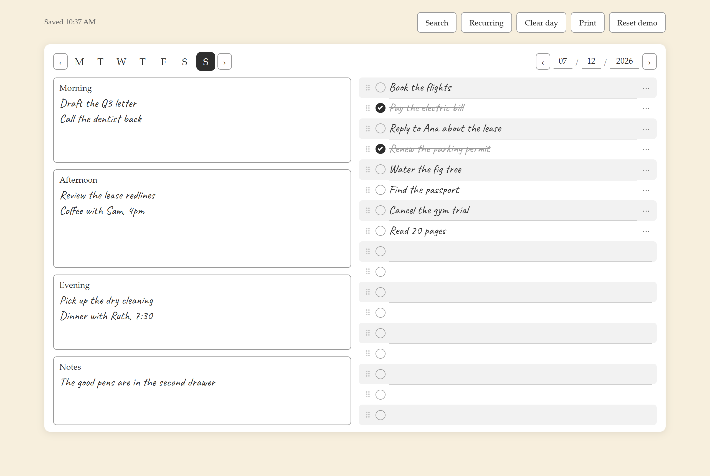
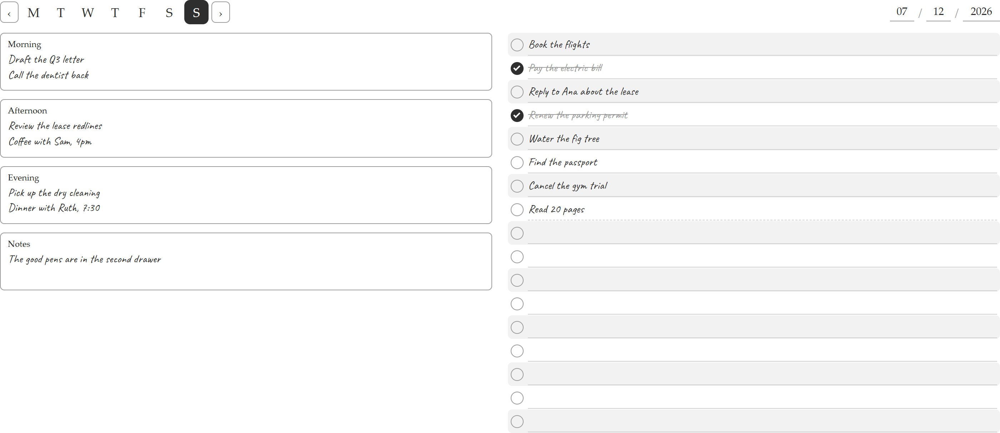

# Daily Planner

**A paper planner that syncs.**

What you type appears in handwriting. The buttons live in the margin, never on the sheet. It prints landscape, on one page, because the point is that it becomes paper again. And underneath the paper is the part most planner apps get wrong: an outbox, per-date version tracking, and real conflict resolution — so an edit you make in a tunnel is still there when you come out of it.

### → [Try it](https://daily-planner-demo.pages.dev)

No signup, no passphrase, no database. Type on it. Reload it. It's yours until you clear it.

Print it and you get this. One page, landscape, no chrome:

---

## How it works

**Every edit goes into an outbox before it goes anywhere else.** It's written to localStorage and queued, and only dropped once the server confirms it. So an edit made offline survives a reload, a tab close, and a flat battery, and syncs when you're back. The status line says which of those is happening, honestly — `Saving… (2)`, `Offline — 2 unsaved, will sync`, `Save failed: 500 — kept on this device`. Never a spinner that means nothing.

**Nothing is ever silently overwritten.** `updated_at` doubles as a version, tracked *per date* — a single global one goes stale the moment you change days while offline, and then invents conflicts for days nobody touched. A save carries the version it was based on. If your phone and your laptop both edited Tuesday, the server refuses the second one, hands back its copy, and the app asks you: **keep mine, or use theirs.** There's a nice subtlety in there: if the server's copy turns out to be *identical to what you just sent*, that isn't a conflict, it's a lost confirmation — so it resolves itself and says nothing.

**Recurring items come back where they came from.** Make a to-do repeat on Tuesdays and it returns to the checklist. Make a line in *Morning* repeat and it returns to Morning. They carry a stable id so they can't duplicate, and merely opening a day never writes a row to the database.

**The handwriting font is self-hosted on purpose.** A CDN font falls back to serif exactly when the app is offline — the one moment the illusion of paper would break.

Two real data-loss bugs have lived in the sync layer, and both were invisible to code review. So there is a behavioural test suite: 128 checks that drive a real browser, click real buttons, and read the real screen. It is the reason the whole thing survived a rewrite from vanilla JS to Preact without changing a line of it.

**Stack:** Preact + Vite + Tailwind, on Cloudflare Pages + D1. It's a PWA, so you can install it.

## About the demo

The demo is the same app with a fake *server*, not a fake sync layer: it keeps `sync.js` untouched and patches `fetch` instead, answering the API from localStorage. So what you're clicking on is the real outbox and the real conflict machinery, running for real — not a stub pretending to. Nothing you type there leaves your browser.

## Honest caveats

- **This is not maintained.** It's public because the work should exist in public, not because I'm looking for users, issues, or pull requests. No support, no roadmap, no promises.
- **The passphrase is not authentication.** It's a shared secret, hashed to namespace your data. Anyone who has it can read your planner. There's no password reset — and because that hash *is* the database key, a passphrase you mistype doesn't show an error, it quietly opens a different, empty planner.
- **Self-hosting is real work.** You'd need a Cloudflare account, a Pages project, and a D1 database. There's no setup guide, and I'm not planning to write one.

## Licence

MIT. See [LICENSE](LICENSE).
